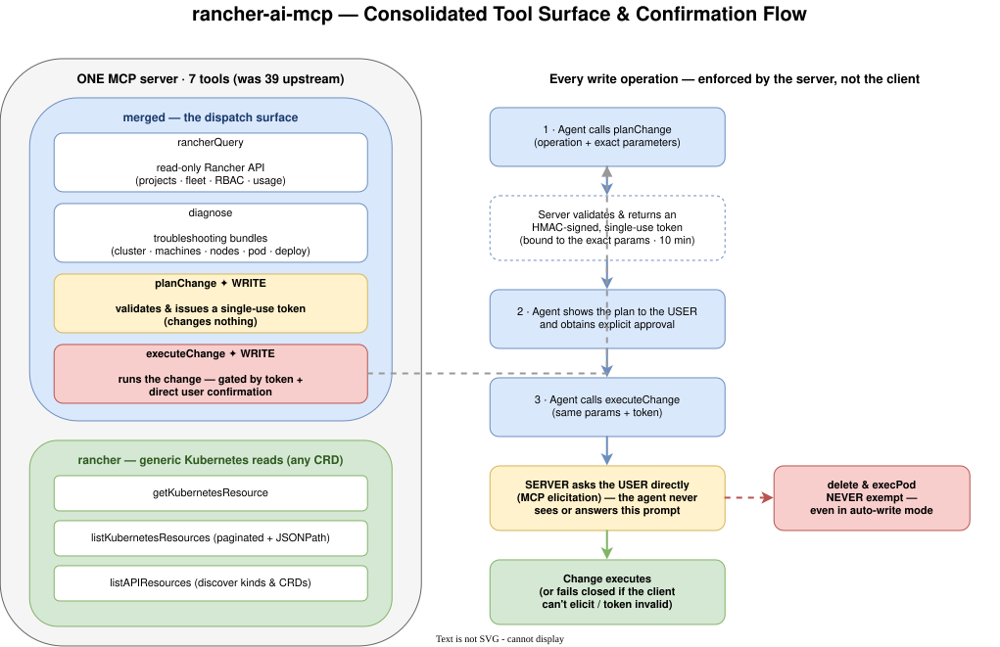
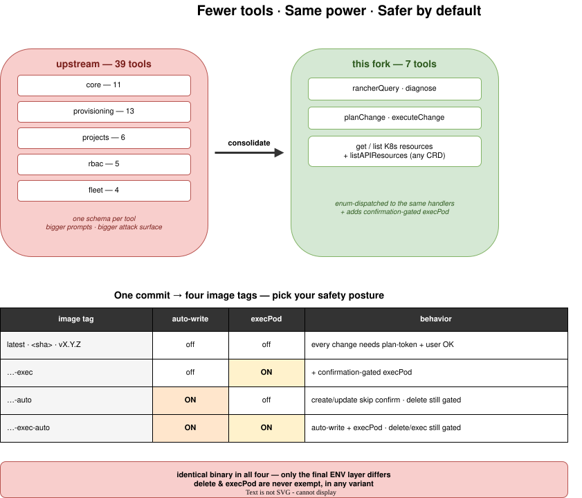

# MCP Server for Rancher

> **39 tools → 7. Every write gated by the human, not the agent.**

An MCP server that lets the [Rancher AI agent](https://github.com/rancher-sandbox/rancher-ai-agent) safely inspect **and change** Kubernetes and Rancher resources across the local and every downstream cluster.

This fork takes the upstream server in two opinionated directions:

- **A drastically smaller surface.** Upstream exposes **39** narrowly-scoped tools; this fork consolidates them into **7** enum-dispatched tools that drive the *same* handlers. Fewer schemas in every prompt, a smaller attack surface, and far less for the model to get wrong — with **zero loss of capability** (any CRD included) and one new addition: a confirmation-gated **`execPod`** operation.
- **Writes the human actually controls.** No write ever runs because the model decided to. Every mutation goes `planChange` → explicit user approval → `executeChange`, where the server issues a single-use HMAC token bound to the *exact* parameters and then asks the **user directly** (via MCP elicitation) — the agent never sees or answers that prompt. If the client can't elicit, the change **fails closed**. `delete` and `execPod` are **never** exempt, even in auto-write mode.

<p align="center">
  
</p>

It expects the Rancher token in a header, which the agent always provides for authentication.

[](https://scorecard.dev/viewer/?uri=github.com/rancher/rancher-ai-mcp)

## Why this fork

| | Upstream | This fork |
|---|----------|-----------|
| **Tool count** | 39 | **7** (same capabilities, enum-dispatched) |
| **Prompt footprint** | 39 schemas | 7 schemas |
| **`execPod`** | — | ✅ opt-in, always confirmation-gated |
| **Write safety** | client-side hints | **server-enforced** plan-token + direct user elicitation |
| **Arbitrary CRDs** | built-in table only | ✅ full `listAPIResources` discovery + GVR resolution |
| **Deployment posture** | one image | **4 tags** — pick auto-write × exec per environment |

## Overview

This Model Context Protocol (MCP) server provides a secure bridge between the Rancher AI agent and Kubernetes clusters, enabling AI-powered cluster management through a standardized tool interface. The server runs as a Kubernetes deployment within the Rancher environment and exposes a small, consolidated set of tools for resource inspection, modification, and cluster operations.

## Architecture

### Package Structure

- **`cmd/`** - CLI commands and server initialization
  - `serve.go` - HTTP/TLS server setup with dynamic listener support
  - `root.go` - Root command configuration

- **`pkg/client/`** - Kubernetes client abstraction
  - Dynamic client wrapper with cluster ID resolution
  - Rancher API integration for cluster management
  - Support for both local and downstream cluster operations

- **`pkg/toolsets/`** - Tool registration and organization
  - `merged/` - The only registration surface: the 7 tools exposed by the server (3 k8s-generic + 4 enum-dispatched)
  - `dispatch/` - Flat-parameter validation, case dispatch, and the merged input schemas
  - `core/`, `fleet/`, `provisioning/` (+ `core/projects`, `core/rbac`) - Per-domain handlers and their query/diagnose/plan/execute case tables; they register no MCP tools themselves
  - `toolsets.go` - `AddAllTools`, which delegates entirely to `merged.Register`
  - `instructions.go` - Builds the server-level safety instructions for the exact configuration in effect

- **`pkg/response/`** - Response formatting utilities
  - Structured text and content generation for MCP responses

- **`pkg/converter/`** - Data transformation utilities
  - Group/Version/Resource (GVR) conversion helpers

### Consolidated Tool Surface

Upstream registers one MCP tool per Rancher operation (39 in total). This fork instead exposes **7 tools** through two toolsets, and routes each to the same underlying handlers by an enum parameter — so capability is preserved while the tool surface, prompt footprint, and per-tool schema validation shrink dramatically.

**Exposed toolsets (the entire MCP surface):**

- **`merged`** — the dispatch surface, 4 tools. Each takes an enum that selects the operation and dispatches to the per-domain handler:
  - `rancherQuery` (read-only Rancher API), `diagnose` (troubleshooting bundles),
  - `planChange` / `executeChange` (the only write path — see the safety model below).
- **`rancher`** — the generic Kubernetes reads, 3 tools: `getKubernetesResource`, `listKubernetesResources`, `listAPIResources`. Kind resolution goes through live API discovery, so **any CRD** works, not just a hardcoded table.

The per-domain logic still lives in `core/`, `fleet/`, `provisioning/`, `projects/`, and `rbac/` — but those packages now only hold handlers and case tables; nothing registers a separate MCP tool. Adding a capability means adding a case, not a new top-level tool.

### TLS & Security

The server supports two modes:

1. **TLS Mode (Production)**: Uses Rancher's dynamic listener with auto-generated certificates
   - Certificates stored as Kubernetes secrets
   - Automatic cert rotation and renewal
   - Client certificate authentication support
   - TLS 1.2+ with secure cipher suites

2. **Insecure Mode (Development)**: Plain HTTP for local testing
   - Enabled via `--insecure` flag or `INSECURE_SKIP_TLS=true`

### Available Tools

Each tool is exposed through the MCP protocol and can be invoked by the Rancher AI agent. The full, up-to-date list of tools grouped by toolset is maintained in [TOOLS.md](TOOLS.md), which is generated from the tool definitions.

To regenerate it after adding or changing tools, run:

```bash
go generate ./...
# or
make generate
```

## Configuration

### Command-line Flags

```bash
--port <int>              Port to listen on (default: 9092)
--insecure                Skip TLS verification (default: false)
--read-only               Register only read-only tools
--allow-auto-write        Let create/update-class ops skip per-op confirmation (env MCP_ALLOW_AUTO_WRITE)
--enable-exec             Enable the confirmation-gated execPod operation (env MCP_ENABLE_EXEC)
```

The full flag/env/default table is in the [safety model](#flags-and-environment-variables) below.

## Safety Model: Mandatory User Confirmation for Write Operations

<p align="center">
  
</p>

Every tool that modifies cluster state or executes commands is gated by the
server, not the client:

1. The agent must call `planChange` first, with the operation and parameters it
   intends to execute. The plan response contains a single-use, 10-minute
   `confirmationToken` bound to the exact operation and parameters
   (HMAC-signed; any parameter change invalidates it).
2. The agent then calls `executeChange` with the same operation and parameters
   plus the token. The server asks the USER directly to confirm via MCP
   elicitation. The `deleteKubernetesResource` operation additionally requires
   the user to type the exact resource name.
3. If the client does not support elicitation, `executeChange` fails closed.
   The `deleteKubernetesResource` and `execPod` operations are never exempted,
   not even in auto-write mode.

### Flags and environment variables

| Flag | Env | Default | Effect |
|------|-----|---------|--------|
| `--read-only` | — | false | register only read-only tools (5 of 7; `planChange`/`executeChange` unregistered) |
| `--allow-auto-write` | `MCP_ALLOW_AUTO_WRITE` | false | create/update-class operations skip the token and confirmation (delete/exec unaffected). For trusted automation only |
| `--enable-exec` | `MCP_ENABLE_EXEC` | false | allow the `execPod` operation of `planChange`/`executeChange` (refused at runtime without it) |

## Deploying this fork with the stock rancher-ai-agent Helm chart

The stock chart hardcodes the MCP container args and has no extraArgs passthrough,
so the supported delivery paths are:

1. **Image-level ENV (recommended, no chart changes).** The GitHub Action builds
   four variants of the same commit — one per `MCP_ALLOW_AUTO_WRITE` × `MCP_ENABLE_EXEC`
   combination; pick the tag by safety posture:

   | Tag | `MCP_ALLOW_AUTO_WRITE` | `MCP_ENABLE_EXEC` | Behavior |
   |-----|----------------------|-------------------|----------|
   | `latest`, `<sha>`, `vX.Y.Z` | `false` | `false` | every change requires plan-token + user confirmation; no exec |
   | `exec`, `<sha>-exec`, `vX.Y.Z-exec` | `false` | `true` | same, plus the confirmation-gated `execPod` operation |
   | `auto`, `<sha>-auto`, `vX.Y.Z-auto` | `true` | `false` | create/update-class operations execute without confirmation; delete still always gated; no exec |
   | `exec-auto`, `<sha>-exec-auto`, `vX.Y.Z-exec-auto` | `true` | `true` | auto-write plus `execPod` enabled; delete and exec still always gated |

   `latest`, `exec`, `auto` and `exec-auto` are floating tags, and the chart's default
   `imagePullPolicy: IfNotPresent` means a node-local cached image is not refreshed on
   upgrade. For reproducible upgrades, pin an immutable tag instead: `<sha>` /
   `<sha>-exec` / `<sha>-auto` / `<sha>-exec-auto` (or the `vX.Y.Z…` equivalents).

   Then point the chart at the image:

   ```yaml
   # my-values.yaml
   global:
     cattle:
       systemDefaultRegistry: ""          # disable the global registry prefix
   aiAgent:
     image:
       repository: registry.suse.com/rancher/rancher-ai-agent   # keep the stock agent image
   mcp:
     image:
       repository: ghcr.io/<your-github-user>/rancher-ai-mcp    # fully qualified fork image
       tag: latest                      # safety-gated; see the table above for the exec/auto variants
   # imagePullSecrets:                    # only if the GHCR package is private
   #   - name: ghcr-pull-secret
   ```

   `helm upgrade -i rancher-ai-agent oci://registry.suse.com/rancher/charts/rancher-ai-agent -n cattle-ai-agent-system -f my-values.yaml`

2. **Post-renderer (no image rebuild):** `helm upgrade ... --post-renderer deploy/postrenderer/patch-args.sh`.

   The shipped `deploy/postrenderer/kustomization.yaml` is a **no-op passthrough**: it appends no
   flags, so the rendered deployment is exactly what the chart produced. Enabling either flag
   requires editing that file — uncomment the `patches:` block and the entries you want.

   > **WARNING:** `--allow-auto-write` lets create/update-class tools execute without
   > per-operation user confirmation. Enable it only for trusted automation.

   **Helm 4 users:** the executable-path `--post-renderer <script>` form works on **Helm 3 only**.
   Helm ≥ 4 rejects it (`plugin: ... Type:postrenderer/v1 not found`) and requires the
   post-renderer packaged as a `postrenderer/v1` plugin. Prefer the image-level ENV path
   (option 1) there.
